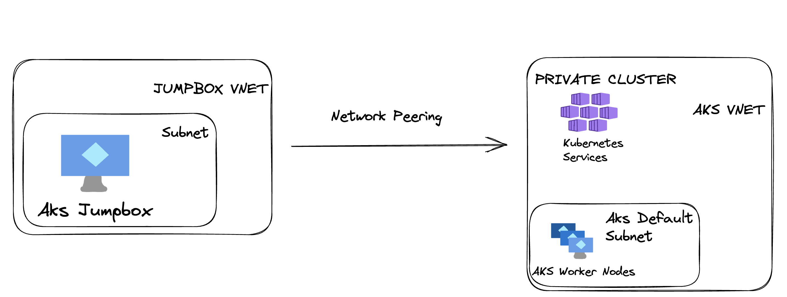

### Creates a Private AKS cluster and a Jumpbox VM 
Both AKS cluster and the Jumpbox are created in separate VNETS
There is a Network peering between VNETS
Using Ansible Terraform provider to install all the necessary tools on the Jumpbox

### Requirements
 - [Terraform](https://developer.hashicorp.com/terraform/tutorials/aws-get-started/install-cli)
 - [Ansible](https://docs.ansible.com/ansible/latest/installation_guide/index.html)
 - [Terraform Ansible Provider](https://registry.terraform.io/providers/ansible/ansible/latest/docs)

